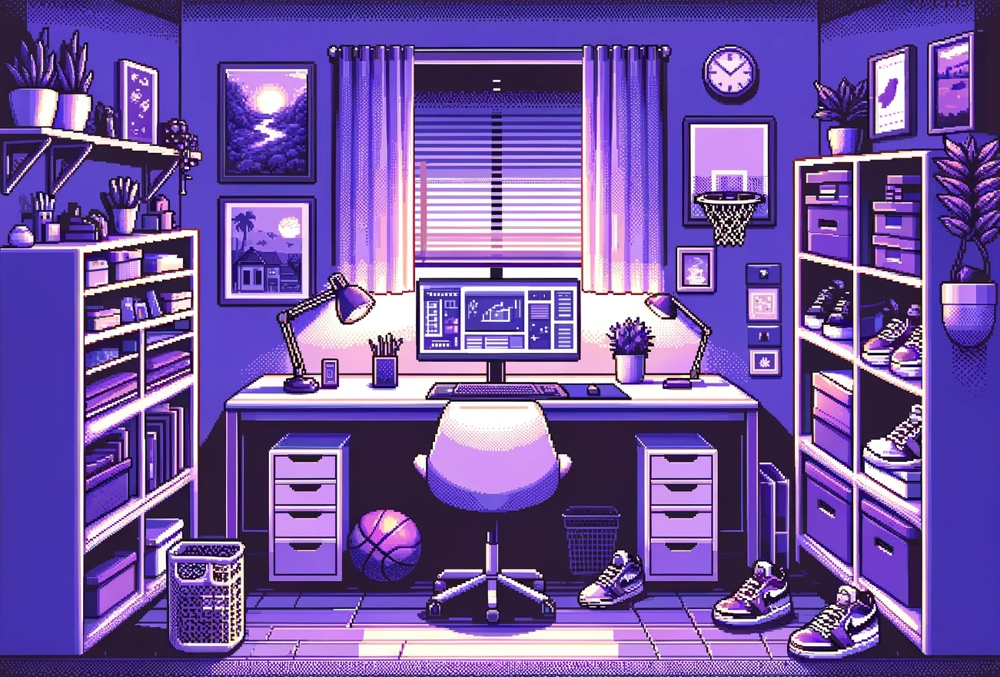

  

  

  

---
<h3 align="center" colour="purple">Student at the University of Waterloo</h3>   

**I'm a Statistics and Computational Mathematics student at the University of Waterloo, passionate about data science, machine learning, and full-stack development. My journey in tech has led me through various roles, from backend software development to full-stack development, where I've engineered solutions that enhance user experiences and streamline operations.**

  
  

- 🔭 I’m currently working on Smartletter, an automated cover letter generator.

- 🌱 I’m currently learning **Langchain**, **Data Structures and Algorithms**, **Computational Statistics and Data Analysis.**

- 👯 I’m looking to collaborate on any projects or hackathons that interest me.

- 🤝 I’m looking for help with learning about ML concepts, DevOps, Cloud Services. 

- 💬 Ask me about *Programming, Cybersecurity, Machine Learning, Full-Stack Development.

- 📫 How to reach me **2krothapasam@gmail.com** or **skrothap@uwaterloo.ca.**

**I like my coffee how I like my code: Constantly refilling and refactoring** 

<h3>What I have been up to:</h3>

-  [Tectonics AI Project](https://docs.google.com/presentation/d/1EWjKo3yUzCzvJ21BpL3S0N8YC04TO4K2/edit#slide=id.)

-  [Cybersecurity Club Website](https://ctf.uwaterloo.ca/)

-  [Network Anomaly Detection](https://wat-ai.github.io/cyber-security-interactive_web_demos/index.html)

  

### Languages:
| Python | R | JavaScript | C# | Java | HTML/CSS | GO |
|:-:|:-:|:-:|:-:|:-:|:-:|:-:|
|  |  |  |  |  |  |  |

### Libraries & Frameworks:

| TensorFlow | Langchain | NumPy | Pandas | Scikit-learn | .NET CORE | Spring | Bootstrap | Chart.js |
|:-:|:-:|:-:|:-:|:-:|:-:|:-:|:-:|:-:|
| |  |  |  |  |  |  |  |  |

### Developer Tools:

| PostgreSQL | Git | Jira | Confluence | GCP | Docker | Postman | Latex | Maven | Vercel
|:-:|:-:|:-:|:-:|:-:|:-:|:-:|:-:|:-:|:-:|
|  |  |  |  |  |  |  |  |  |  |

<picture>   </picture> Github Stats 

<!--- stats & Trophy (start) -->

  <!--- stats (start) -->
<table align="center">
<tr border="none">
<td width="50%" align="center">
  
    
   
</td>

<td width="50%" align="center">

  
</tr>
</table>

  

<!--- stats (end) -->
<!--- stats (end)

 -->

<!--- 

&nbsp;

-->
<!--- <h2 align="Center"> 🤝 Connect with me: </h2>

     <a href="https://kaggle.com/https://www.kaggle.com/samikrothapalli" target="blank">  

<h2 align="Center"> Other Accounts </h2>

